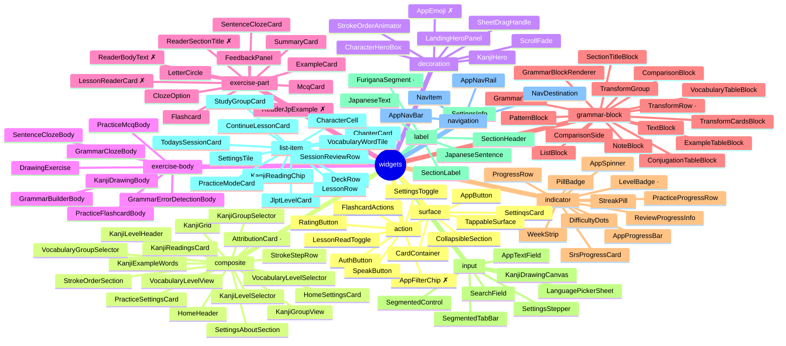

# Widget Inventory

Generated by `scripts/design/widget_inventory.py`. Do not edit by hand — edit the role map in that script and regenerate.

Widgets are grouped by **purpose**, not by directory. Directory groups by feature area, which is why two buttons living in `common/` went unnoticed through several reviews. Two public widgets sharing a role is not automatically wrong, but it always needs a reason.

112 widget classes across 12 roles.

## Roles at a glance

`✗` unused anywhere. `·` used only inside its own file.

## action

_Things you press. One button engine; anything else here needs a reason._

| Widget | Uses | File |
| --- | --- | --- |
| `AppButton` | 9 | `common/app_button.dart` |
| `FlashcardActions` | 6 | `exercise/flashcard.dart` |
| `SpeakButton` | 6 | `common/speak_button.dart` |
| `AuthButton` | 3 | `common/auth_button.dart` |
| `SettingsToggle` | 3 | `settings/settings_toggle.dart` |
| `LessonReadToggle` | 1 | `grammar/lesson_read_toggle.dart` |
| `RatingButton` | 1 | `exercise/flashcard.dart` |
| `AppFilterChip` | **0** | `common/app_filter_chip.dart` |

## composite

_A whole section or view assembled from smaller widgets._

| Widget | Uses | File |
| --- | --- | --- |
| `KanjiLevelHeader` | 2 | `characters/kanji_level_header.dart` |
| `HomeHeader` | 1 | `study/home_header.dart` |
| `HomeSettingsCard` | 1 | `settings/home_settings_card.dart` |
| `KanjiExampleWords` | 1 | `characters/kanji_example_words.dart` |
| `KanjiGrid` | 1 | `characters/kanji_grid.dart` |
| `KanjiGroupSelector` | 1 | `study/kanji_group_selector.dart` |
| `KanjiGroupView` | 1 | `study/kanji_group_view.dart` |
| `KanjiLevelSelector` | 1 | `study/kanji_level_selector.dart` |
| `KanjiReadingsCard` | 1 | `characters/kanji_readings_card.dart` |
| `PracticeSettingsCard` | 1 | `settings/practice_settings_card.dart` |
| `SettingsAboutSection` | 1 | `settings/settings_about_section.dart` |
| `StrokeOrderSection` | 1 | `characters/stroke_order_section.dart` |
| `StrokeStepRow` | 1 | `characters/stroke_step_row.dart` |
| `VocabularyGroupSelector` | 1 | `study/vocabulary_group_selector.dart` |
| `VocabularyLevelSelector` | 1 | `study/vocabulary_level_selector.dart` |
| `VocabularyLevelView` | 1 | `study/vocabulary_level_view.dart` |
| `AttributionCard` | 0 (internal ×3) | `settings/settings_about_section.dart` |

## decoration

_Purely visual furniture with no state of its own._

| Widget | Uses | File |
| --- | --- | --- |
| `ScrollFade` | 11 | `common/scroll_fade.dart` |
| `SheetDragHandle` | 3 | `common/sheet_drag_handle.dart` |
| `CharacterHeroBox` | 2 | `characters/character_hero_box.dart` |
| `StrokeOrderAnimator` | 2 | `characters/stroke_animators.dart` |
| `KanjiHero` | 1 | `characters/kanji_hero.dart` |
| `LandingHeroPanel` | 1 | `common/landing_hero_panel.dart` |
| `AppEmoji` | **0** | `common/app_emoji.dart` |

## exercise-body

_Owns one question type end to end inside a session._

| Widget | Uses | File |
| --- | --- | --- |
| `DrawingExercise` | 3 | `exercise/drawing_exercise.dart` |
| `GrammarBuilderBody` | 1 | `exercise/grammar_builder_body.dart` |
| `GrammarClozeBody` | 1 | `exercise/grammar_cloze_body.dart` |
| `GrammarErrorDetectionBody` | 1 | `exercise/grammar_error_detection_body.dart` |
| `KanjiDrawingBody` | 1 | `exercise/kanji_drawing_body.dart` |
| `PracticeFlashcardBody` | 1 | `exercise/practice_flashcard_body.dart` |
| `PracticeMcqBody` | 1 | `exercise/practice_mcq_body.dart` |
| `SentenceClozeBody` | 1 | `exercise/sentence_cloze_body.dart` |

## exercise-part

_A piece an exercise body composes._

| Widget | Uses | File |
| --- | --- | --- |
| `LetterCircle` | 3 | `exercise/letter_circle.dart` |
| `McqCard` | 2 | `exercise/mcq_card.dart` |
| `ClozeOption` | 1 | `exercise/cloze_option.dart` |
| `ExampleCard` | 1 | `exercise/example_card.dart` |
| `FeedbackPanel` | 1 | `exercise/feedback_panel.dart` |
| `Flashcard` | 1 | `exercise/flashcard.dart` |
| `SentenceClozeCard` | 1 | `exercise/sentence_cloze_card.dart` |
| `SummaryCard` | 1 | `exercise/summary_card.dart` |
| `LessonReaderCard` | **0** | `exercise/lesson_reader.dart` |
| `ReaderBodyText` | **0** | `exercise/lesson_reader.dart` |
| `ReaderJpExample` | **0** | `exercise/lesson_reader.dart` |
| `ReaderSectionTitle` | **0** | `exercise/lesson_reader.dart` |

## grammar-block

_One authored lesson block type, driven by content JSON._

| Widget | Uses | File |
| --- | --- | --- |
| `GrammarTable` | 3 | `grammar/blocks/grammar_table.dart` |
| `TextBlock` | 2 | `grammar/blocks/text_block.dart` |
| `ComparisonBlock` | 1 | `grammar/blocks/comparison_block.dart` |
| `ComparisonSide` | 1 | `grammar/blocks/comparison_block.dart` |
| `ConjugationTableBlock` | 1 | `grammar/blocks/conjugation_table_block.dart` |
| `ExampleTableBlock` | 1 | `grammar/blocks/example_table_block.dart` |
| `GrammarBlockRenderer` | 1 | `grammar/grammar_block_renderer.dart` |
| `ListBlock` | 1 | `grammar/blocks/list_block.dart` |
| `NoteBlock` | 1 | `grammar/blocks/note_block.dart` |
| `PatternBlock` | 1 | `grammar/blocks/pattern_block.dart` |
| `SectionTitleBlock` | 1 | `grammar/blocks/section_title_block.dart` |
| `TransformCardsBlock` | 1 | `grammar/blocks/transform_cards_block.dart` |
| `TransformGroup` | 1 | `grammar/blocks/transform_cards_block.dart` |
| `VocabularyTableBlock` | 1 | `grammar/blocks/vocabulary_table_block.dart` |
| `TransformRow` | 0 (internal ×3) | `grammar/blocks/transform_cards_block.dart` |

## indicator

_Read-only status: progress, counts, streaks, badges._

| Widget | Uses | File |
| --- | --- | --- |
| `PillBadge` | 20 | `common/pill_badge.dart` |
| `AppSpinner` | 19 | `common/app_spinner.dart` |
| `PracticeProgressRow` | 8 | `exercise/practice_progress_row.dart` |
| `AppProgressBar` | 3 | `common/progress_bar.dart` |
| `ProgressRow` | 3 | `common/progress_row.dart` |
| `DifficultyDots` | 2 | `common/difficulty_dots.dart` |
| `ReviewProgressInfo` | 2 | `common/review_progress_info.dart` |
| `SrsProgressCard` | 2 | `characters/srs_progress_card.dart` |
| `StreakPill` | 1 | `study/streak_pill.dart` |
| `WeekStrip` | 1 | `study/week_strip.dart` |
| `LevelBadge` | 0 (internal ×1) | `common/jlpt_level_card.dart` |

## input

_Things you type into, draw on, or pick from._

| Widget | Uses | File |
| --- | --- | --- |
| `SegmentedControl` | 6 | `common/segmented_control.dart` |
| `SearchField` | 2 | `common/search_field.dart` |
| `SettingsStepper` | 2 | `settings/settings_stepper.dart` |
| `AppTextField` | 1 | `common/app_text_field.dart` |
| `KanjiDrawingCanvas` | 1 | `characters/kanji_drawing_canvas.dart` |
| `LanguagePickerSheet` | 1 | `settings/language_picker_sheet.dart` |
| `SegmentedTabBar` | 1 | `common/segmented_tab_bar.dart` |

## label

_Text presentation, including Japanese-specific typography._

| Widget | Uses | File |
| --- | --- | --- |
| `SectionLabel` | 18 | `common/section_label.dart` |
| `JapaneseText` | 7 | `common/japanese_text.dart` |
| `SectionHeader` | 3 | `common/section_header.dart` |
| `JapaneseSentence` | 1 | `common/japanese_sentence.dart` |
| `SettingsInfo` | 1 | `settings/settings_info.dart` |
| `FuriganaSegment` | 0 (internal ×8) | `common/japanese_text.dart` |

## list-item

_One row or tile inside a list or grid._

| Widget | Uses | File |
| --- | --- | --- |
| `SettingsTile` | 5 | `settings/settings_tile.dart` |
| `DeckRow` | 3 | `study/deck_row.dart` |
| `JlptLevelCard` | 3 | `common/jlpt_level_card.dart` |
| `CharacterCell` | 2 | `characters/character_cell.dart` |
| `KanjiReadingChip` | 2 | `characters/kanji_readings_card.dart` |
| `PracticeModeCard` | 2 | `study/practice_mode_card.dart` |
| `StudyGroupCard` | 2 | `study/study_group_card.dart` |
| `VocabularyWordTile` | 2 | `study/vocabulary_word_tile.dart` |
| `ChapterCard` | 1 | `study/chapter_card.dart` |
| `ContinueLessonCard` | 1 | `study/continue_lesson_card.dart` |
| `LessonRow` | 1 | `study/lesson_row.dart` |
| `SessionReviewRow` | 1 | `exercise/session_review_row.dart` |
| `TodaysSessionCard` | 1 | `study/todays_session_card.dart` |

## navigation

_Moving between tabs and destinations._

| Widget | Uses | File |
| --- | --- | --- |
| `NavDestination` | 5 | `navigation/nav_destination.dart` |
| `NavItem` | 2 | `navigation/nav_item.dart` |
| `AppNavBar` | 1 | `navigation/app_nav_bar.dart` |
| `AppNavRail` | 1 | `navigation/app_nav_rail.dart` |

## surface

_Generic containers other widgets sit inside._

| Widget | Uses | File |
| --- | --- | --- |
| `CardContainer` | 10 | `common/card_container.dart` |
| `SettingsCard` | 7 | `settings/settings_card.dart` |
| `TappableSurface` | 7 | `common/tappable_surface.dart` |
| `CollapsibleSection` | 1 | `common/collapsible_section.dart` |

## Used only inside their own file

Candidates for a leading underscore, so the barrel stops exporting them.

- `AttributionCard` — `settings/settings_about_section.dart`
- `FuriganaSegment` — `common/japanese_text.dart`
- `LevelBadge` — `common/jlpt_level_card.dart`
- `TransformRow` — `grammar/blocks/transform_cards_block.dart`

## Design-system bypasses

36 raw Material button usages across 11 files outside `widgets/common/`. Each one is a button `AppButton` is not styling.

| Material widget | Files | Usages |
| --- | --- | --- |
| `OutlinedButton` | 3 | 6 |
| `FilledButton` | 3 | 7 |
| `TextButton` | 9 | 23 |

## Findings

- 7 widgets share the `action` role: `AppButton`, `FlashcardActions`, `SpeakButton`, `AuthButton`, `SettingsToggle`, `LessonReadToggle`, `RatingButton`
- `AppEmoji` is unused (lib/presentation/widgets/common/app_emoji.dart)
- `AppFilterChip` is unused (lib/presentation/widgets/common/app_filter_chip.dart)
- `LessonReaderCard` is unused (lib/presentation/widgets/exercise/lesson_reader.dart)
- `ReaderBodyText` is unused (lib/presentation/widgets/exercise/lesson_reader.dart)
- `ReaderSectionTitle` is unused (lib/presentation/widgets/exercise/lesson_reader.dart)
- `ReaderJpExample` is unused (lib/presentation/widgets/exercise/lesson_reader.dart)
- 36 raw Material button usages bypass AppButton

